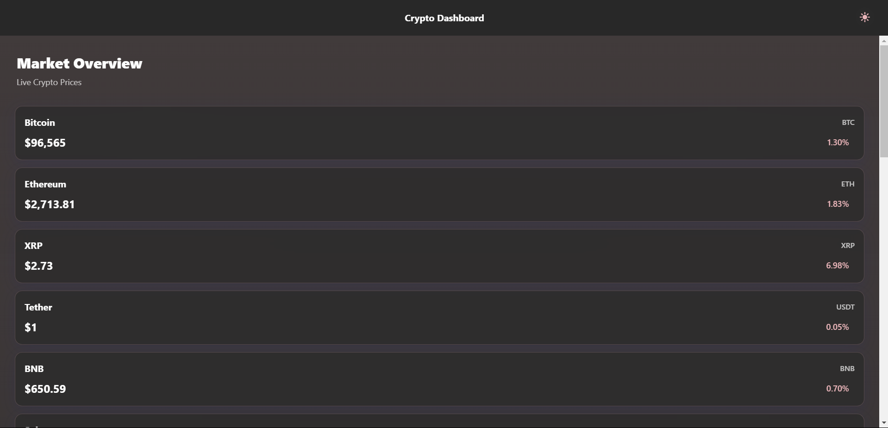
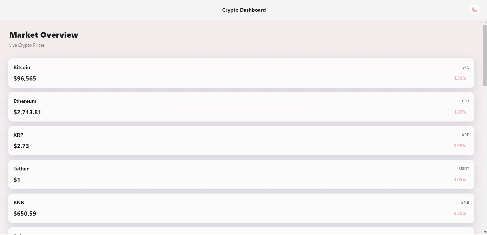
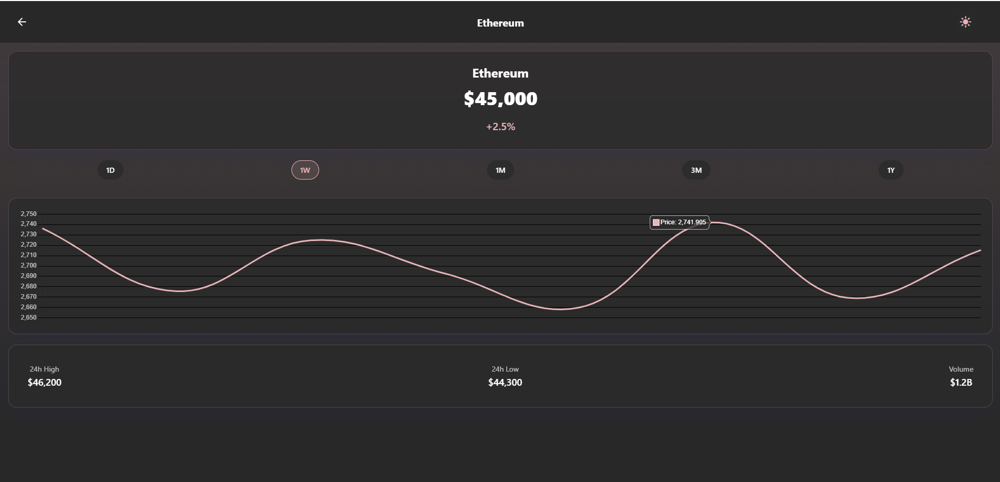
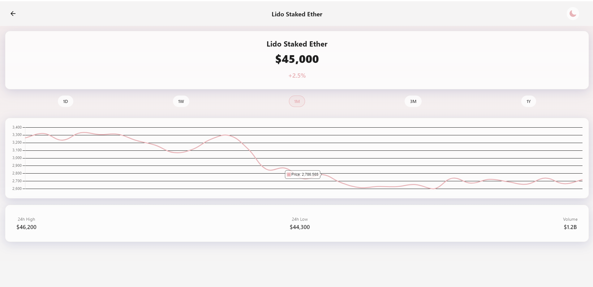

# Crypto Dashboard

A cross-platform (Web, iOS, Android) cryptocurrency tracking application built with React Native and Expo. Features real-time price updates, historical data visualization, and an aesthetic glass-morphism UI design.

## Features

- 🚀 Real-time cryptocurrency price tracking
- 📊 Interactive price charts with multiple timeframes
- 🌓 Dark/Light theme support
- 💎 Glass-morphism UI design
- ⚡ Live price updates every 30 seconds
- 📱 Responsive design for web and mobile platforms
- 📈 Historical price data visualization
- 🔄 Pull-to-refresh functionality

## Gallery

## Tech Stack

- React Native / Expo
- React Navigation
- Chart.js (Web) / React Native Chart Kit (Mobile)
- CoinGecko API
- Axios
- Expo Linear Gradient
- React Native Reanimated

## Prerequisites

- Node.js (v14 or higher)
- npm or yarn
- Expo CLI
- iOS Simulator (for iOS development)
- Android Studio (for Android development)

## Installation

1. Clone the repository:
2. Install dependencies:

## API Integration

The application uses the CoinGecko API for cryptocurrency data. API calls are managed through the cryptoApi service with built-in retry logic for rate limiting.

Reference: https://www.coingecko.com/api/documentation

## License

This project is licensed under the MIT License - see the LICENSE file for details.

